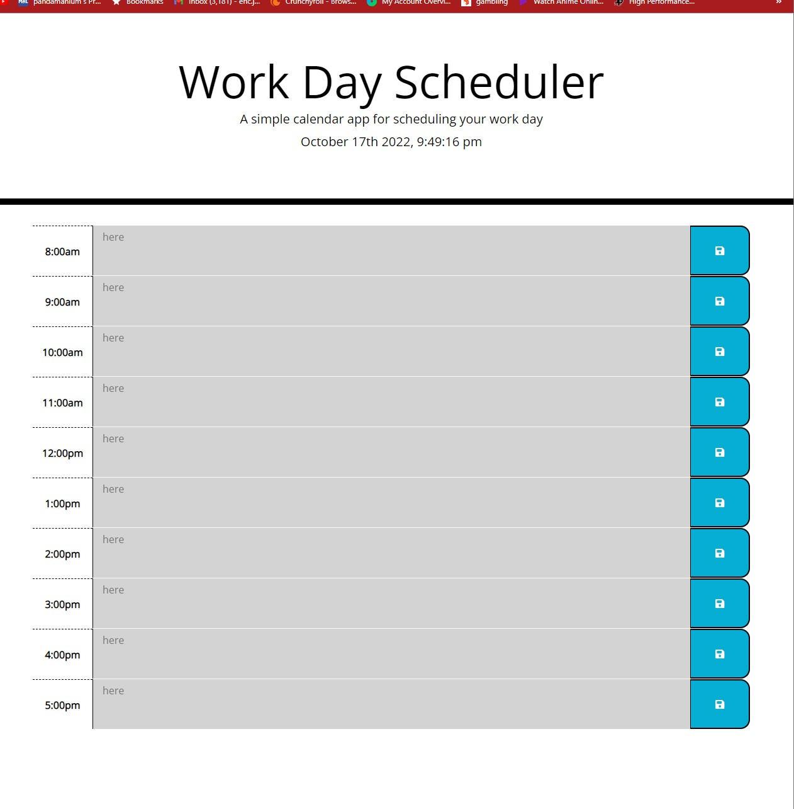

# challenge.-1
Challenge.5 10/17/2022

## Decription
This is challenge-5, 

-My motivation for this project is to get better at DOM traversals, jquerys and bootstrap

-I finished the project to make a day planner that uses apis to keep track of the time

-The problem I solved was to utilize DOM traversals and APIs to make a day planner that changed with the current time

-I learned how to call and use API's to make the script and css sheet smaller

## Instalation
steps to initialize webpage

-first download the repo from github to local machine

-then open html file on visual studios

-then open right click and copy path then paste into a browser and press enter

-or use this url: https://ejasato.github.io/challenge5-workdayscheduler-/

## Usage

## Credits

-used bootstrap and jquery

## License
